# 🌟 Welcome to my Digital Universe! 🌟

```ascii
╔══════════════════════════════════════════════════════════════╗
║  ██████╗ ████████╗████████╗██████╗  ██╗ █████╗  █████╗       ║
║  ██╔══██╗╚══██╔══╝╚══██╔══╝╚════██╗███║██╔══██╗██╔══██╗      ║
║  ██████╔╝   ██║      ██║    █████╔╝╚██║╚██████║╚██████║      ║
║  ██╔═══╝    ██║      ██║    ╚═══██╗ ██║ ╚═══██║ ╚═══██║      ║
║  ██║        ██║      ██║   ██████╔╝ ██║ █████╔╝ █████╔╝      ║
║  ╚═╝        ╚═╝      ╚═╝   ╚═════╝  ╚═╝ ╚════╝  ╚════╝       ║
╚══════════════════════════════════════════════════════════════╝
```


<div align="center">
  
🏁━━━━━━━━━━━━━━━━━━━━━━━━━━━━━━━━━━━━━━━━━━━━━━━━━━━━━━━━━━━━━━━━━━━━━━━━━━━━━━━━━━━━━━━━━━━━━━━━━━━━━━━━━━━━━🏁

</div>

## 🎭 About Me


```javascript
const ptt3199 = {
    pronouns: "He/Him",
    location: "Vietnam 🇻🇳",
    currentStatus: "Building awesome things",
    hobbies: ["Coding", "F1 Racing 🏎️", "Gaming", "Music", "Coffee ☕"],
    favoriteF1Driver: "Max Verstappen 🏆",
    favoriteTeam: "Red Bull Racing 🔵🔴",
    funFact: "I debug with console.log and I'm not ashamed! 😄",
    currentlyLearning: ["Next.js", "TypeScript", "DevOps"],
    askMeAbout: [
        "Web Development", 
        "JavaScript", 
        "React", 
        "Node.js",
        "F1 Racing 🏎️",
        "Coffee recommendations ☕"
    ]
};
```

<br clear="right"/>

<div align="center">
  
🏁━━━━━━━━━━━━━━━━━━━━━━━━━━━━━━━━━━━━━━━━━━━━━━━━━━━━━━━━━━━━━━━━━━━━━━━━━━━━━━━━━━━━━━━━━━━━━━━━━━━━━━━━━━━━━🏁

</div>

## 🛠️ Tech Stack & Tools

<div align="center">

### 💻 Languages


### 🚀 Frameworks & Libraries


<!--  -->
<!--  -->


### 🗄️ Databases & Cloud


<!--  -->
<!--  -->


### 🔧 Tools & Others


<!--  -->

</div>

<div align="center">
  
🏁━━━━━━━━━━━━━━━━━━━━━━━━━━━━━━━━━━━━━━━━━━━━━━━━━━━━━━━━━━━━━━━━━━━━━━━━━━━━━━━━━━━━━━━━━━━━━━━━━━━━━━━━━━━━━🏁

</div>

## 📊 GitHub Analytics

<div align="center">
  
  
</div>

<div align="center">
  
</div>

<div align="center">
  
🏁━━━━━━━━━━━━━━━━━━━━━━━━━━━━━━━━━━━━━━━━━━━━━━━━━━━━━━━━━━━━━━━━━━━━━━━━━━━━━━━━━━━━━━━━━━━━━━━━━━━━━━━━━━━━━🏁

</div>

## 🎯 Current Mission

```mermaid
graph LR
    A[🏁 Learning] --> B[⚡ Building]
    B --> C[🚀 Deploying]
    C --> D[🔄 Optimizing]
    D --> A
    
    style A fill:#FF1E1E,color:#fff
    style B fill:#1E90FF,color:#fff
    style C fill:#32CD32,color:#fff
    style D fill:#FFD700,color:#000
```

<div align="center">



</div>

<div align="center">
  
🏁━━━━━━━━━━━━━━━━━━━━━━━━━━━━━━━━━━━━━━━━━━━━━━━━━━━━━━━━━━━━━━━━━━━━━━━━━━━━━━━━━━━━━━━━━━━━━━━━━━━━━━━━━━━━━🏁

</div>

- 🔭 I'm currently working on **Full-Stack Web Applications**
- 🌱 I'm currently learning **Advanced React Patterns & DevOps**
- 👯 I'm looking to collaborate on **Open Source Projects**
- 🤔 I'm looking for help with **System Design & Architecture**
- 💬 Ask me about **JavaScript, React, Node.js, or anything tech!**
- 📫 How to reach me: **Check the links below!**
- ⚡ Fun fact: **I can solve a Rubik's cube in under 2 minutes! 🧩**

<div align="center">
  
🏁━━━━━━━━━━━━━━━━━━━━━━━━━━━━━━━━━━━━━━━━━━━━━━━━━━━━━━━━━━━━━━━━━━━━━━━━━━━━━━━━━━━━━━━━━━━━━━━━━━━━━━━━━━━━━🏁

</div>

## 🎮 GitHub Activity

<div align="center">
  
</div>

<div align="center">
  
🏁━━━━━━━━━━━━━━━━━━━━━━━━━━━━━━━━━━━━━━━━━━━━━━━━━━━━━━━━━━━━━━━━━━━━━━━━━━━━━━━━━━━━━━━━━━━━━━━━━━━━━━━━━━━━━🏁

</div>

## 🏆 GitHub Trophies

<div align="center">
  
</div>

<div align="center">
  
🏁━━━━━━━━━━━━━━━━━━━━━━━━━━━━━━━━━━━━━━━━━━━━━━━━━━━━━━━━━━━━━━━━━━━━━━━━━━━━━━━━━━━━━━━━━━━━━━━━━━━━━━━━━━━━━🏁

</div>

## 🌐 Connect With Me

<div align="center">

[](https://yourportfolio.com)
[](https://linkedin.com/in/yourprofile)
[](mailto:your.email@gmail.com)
[](https://twitter.com/yourhandle)
[](https://instagram.com/yourhandle)

</div>

<div align="center">
  
🏁━━━━━━━━━━━━━━━━━━━━━━━━━━━━━━━━━━━━━━━━━━━━━━━━━━━━━━━━━━━━━━━━━━━━━━━━━━━━━━━━━━━━━━━━━━━━━━━━━━━━━━━━━━━━━🏁

</div>

## 📈 Contribution Graph

<div align="center">
  
</div>

<div align="center">
  
🏁━━━━━━━━━━━━━━━━━━━━━━━━━━━━━━━━━━━━━━━━━━━━━━━━━━━━━━━━━━━━━━━━━━━━━━━━━━━━━━━━━━━━━━━━━━━━━━━━━━━━━━━━━━━━━🏁

</div>

<div align="center">

### 💖 Thanks for visiting my profile!


**"Code fast, debug faster! 🏎️💨"** 

 <em><b>I love connecting with different people</b> so if you want to say <b>hi, I'll be happy to meet you more!</b> 😊</em>

🏁 **Ready, Set, Code!** 🏁

</div>